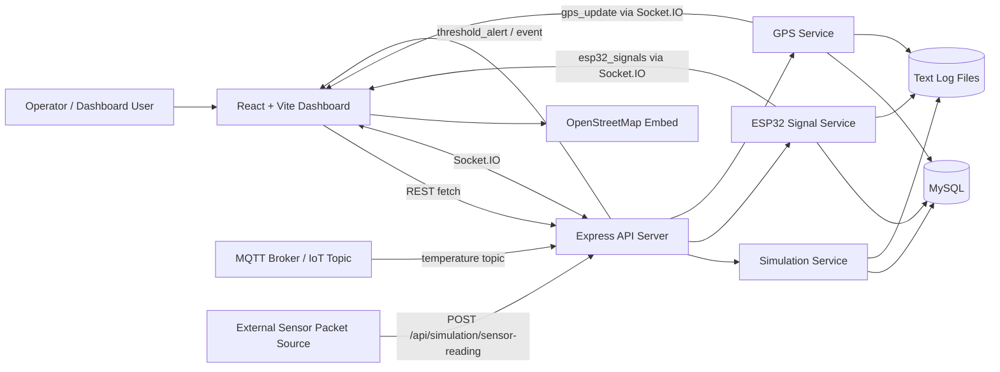
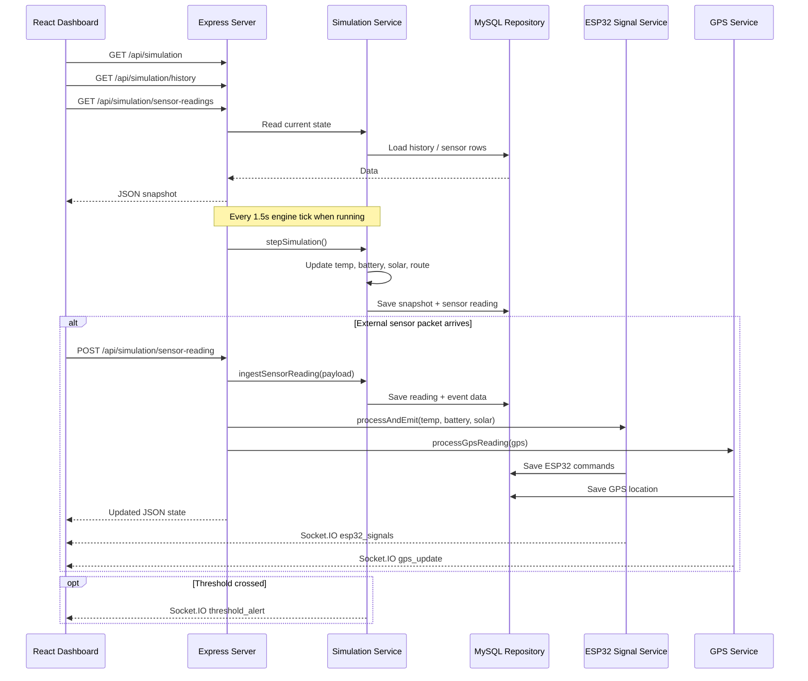

# ColdGuard System Diagram

## High-Level Architecture

```mermaid
flowchart LR
    User[Operator / Dashboard User]
    Client[React + Vite Dashboard]
    API[Express API Server]
    Sim[Simulation Service]
    MQTT[MQTT Broker / IoT Topic]
    Sensor[External Sensor Packet Source]
    ESP32[ESP32 Signal Service]
    GPS[GPS Service]
    DB[(MySQL)]
    Logs[(Text Log Files)]
    Map[OpenStreetMap Embed]

    User --> Client

    Client -->|REST fetch| API
    Client <-->|Socket.IO| API
    Client --> Map

    MQTT -->|temperature topic| API
    Sensor -->|POST /api/simulation/sensor-reading| API

    API --> Sim
    Sim --> DB
    Sim --> Logs
    API --> ESP32
    API --> GPS
    ESP32 --> DB
    ESP32 --> Logs
    GPS --> DB
    GPS --> Logs

    API -->|threshold_alert / event| Client
    ESP32 -->|esp32_signals via Socket.IO| Client
    GPS -->|gps_update via Socket.IO| Client
```

## Runtime Flow

```mermaid
sequenceDiagram
    participant Dashboard as React Dashboard
    participant Server as Express Server
    participant Sim as Simulation Service
    participant Repo as MySQL Repository
    participant ESP as ESP32 Signal Service
    participant GPS as GPS Service

    Dashboard->>Server: GET /api/simulation
    Dashboard->>Server: GET /api/simulation/history
    Dashboard->>Server: GET /api/simulation/sensor-readings
    Server->>Sim: Read current state
    Sim->>Repo: Load history / sensor rows
    Repo-->>Server: Data
    Server-->>Dashboard: JSON snapshot

    Note over Server,Sim: Every 1.5s engine tick when running
    Server->>Sim: stepSimulation()
    Sim->>Sim: Update temp, battery, solar, route
    Sim->>Repo: Save snapshot + sensor reading

    alt External sensor packet arrives
        Dashboard->>Server: POST /api/simulation/sensor-reading
        Server->>Sim: ingestSensorReading(payload)
        Sim->>Repo: Save reading + event data
        Server->>ESP: processAndEmit(temp, battery, solar)
        Server->>GPS: processGpsReading(gps)
        ESP->>Repo: Save ESP32 commands
        GPS->>Repo: Save GPS location
        Server-->>Dashboard: Updated JSON state
        ESP-->>Dashboard: Socket.IO esp32_signals
        GPS-->>Dashboard: Socket.IO gps_update
    end

    opt Threshold crossed
        Sim-->>Dashboard: Socket.IO threshold_alert
    end
```
